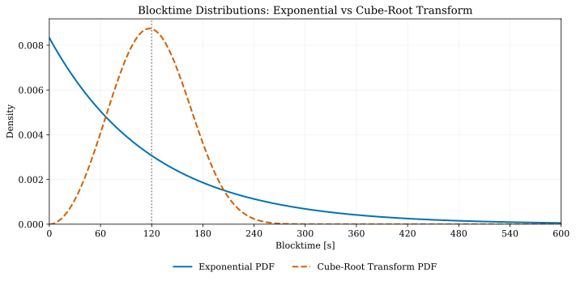

# Bitcoin-PoCX: Energy-Efficient Consensus for Bitcoin Core

**Version**: 2.0 Draft
**Date**: December 2025
**Organization**: Proof of Capacity Consortium

---

## Abstract

Bitcoin's Proof-of-Work (PoW) consensus provides robust security but consumes substantial energy due to continuous real-time hash computation. We present Bitcoin-PoCX, a Bitcoin fork that replaces PoW with Proof of Capacity (PoC), where miners precompute and store large sets of disk-stored hashes during plotting and subsequently mine by performing lightweight lookups instead of ongoing hashing. By shifting computation from the mining phase to a one-time plotting phase, Bitcoin-PoCX drastically reduces energy consumption while enabling mining on commodity hardware, lowering the barrier to participation and mitigating centralization pressures inherent in ASIC-dominated PoW, all while preserving Bitcoin's security assumptions and economic behavior.

Our implementation introduces several key innovations:
(1) A hardened plot format that eliminates all known time–memory-tradeoff attacks in existing PoC systems, ensuring that effective mining power remains strictly proportional to committed storage capacity;
(2) The Time-Bending algorithm, which transforms deadline distributions from exponential to chi-squared, reducing block-time variance without altering the mean;
(3) An OP_RETURN-based forging-assignment mechanism enabling non-custodial pool mining; and
(4) Dynamic compression scaling, which increases plot-generation difficulty in alignment with halving schedules to maintain long-term security margins as hardware improves.

Bitcoin-PoCX maintains Bitcoin Core's architecture through minimal, feature-flagged modifications, isolating PoC logic from the existing consensus code. The system preserves Bitcoin's monetary policy by targeting a 120-second block interval and adjusting the block subsidy to 10 BTC. The reduced subsidy offsets the five-fold increase in block frequency, keeping the long-term issuance rate aligned with Bitcoin's original schedule and maintaining the ~21 million maximum supply.

---

## 1. Introduction

### 1.1 Motivation

Bitcoin's Proof-of-Work (PoW) consensus has proven secure over more than a decade, but at significant cost: miners must continuously expend computational resources, resulting in high energy consumption. Beyond efficiency concerns, there is a broader motivation: exploring alternative consensus mechanisms that maintain security while lowering the barrier to participation. PoC enables virtually anyone with commodity storage hardware to mine effectively, reducing the centralization pressures seen in ASIC-dominated PoW mining.

Proof of Capacity (PoC) achieves this by deriving mining power from storage commitment rather than ongoing computation. Miners precompute large sets of disk-stored hashes—plots—during a one-time plotting phase. Mining then consists of lightweight lookups, drastically reducing energy use while preserving the security assumptions of resource-based consensus.

### 1.2 Integration with Bitcoin Core

Bitcoin-PoCX integrates PoC consensus into Bitcoin Core rather than creating a new blockchain. This approach leverages Bitcoin Core's proven security, mature networking stack, and widely adopted tooling, while keeping modifications minimal and feature-flagged. PoC logic is isolated from existing consensus code, ensuring that core functionality—block validation, wallet operations, transaction formats—remains largely unchanged.

### 1.3 Design Goals

**Security**: Retain Bitcoin-equivalent robustness; attacks require majority storage capacity.

**Efficiency**: Reduce ongoing computational load to disk I/O levels.

**Accessibility**: Enable mining with commodity hardware, lowering barriers to entry.

**Minimal Integration**: Introduce PoC consensus with minimal modification footprint.

---

## 2. Background: Proof of Capacity

### 2.1 History

Proof of Capacity (PoC) was introduced by Burstcoin in 2014 as an energy-efficient alternative to Proof-of-Work (PoW). Burstcoin demonstrated that mining power could be derived from committed storage rather than continuous real-time hashing: miners precomputed large datasets ("plots") once and then mined by reading small, fixed portions of them.

Early PoC implementations proved the concept viable but also revealed that plot format and cryptographic structure are critical for security. Several time–memory tradeoffs allowed attackers to mine effectively with less storage than honest participants. This highlighted that PoC security hinges on plot design—not merely on using storage as a resource.

Burstcoin's legacy established PoC as a practical consensus mechanism and provided the foundation on which PoCX builds.

### 2.2 Core Concepts

PoC mining is based on large, precomputed plot files stored on disk. These plots contain "frozen computation": expensive hashing is performed once during plotting, and mining then consists of lightweight disk reads and simple verification. Core elements include:

**Nonce:**
The basic unit of plot data. Each nonce contains 4096 scoops (256 KiB total) generated via Shabal256 from the miner's address and nonce index.

**Scoop:**
A 64-byte segment inside a nonce. For each block, the network deterministically selects a scoop index (0–4095) based on the previous block's generation signature. Only this scoop per nonce must be read.

**Generation Signature:**
A 256-bit value derived from the prior block. It provides entropy for scoop selection and prevents miners from predicting future scoop indices.

**Warp:**
A structural group of 4096 nonces (1 GiB). Warps are the relevant unit for compression-resistant plot formats.

### 2.3 Mining Process and Quality Pipeline

PoC mining consists of a one-time plotting step and a lightweight per-block routine:

**One-Time Setup:**
- Plot generation: Compute nonces via Shabal256 and write them to disk.

**Per-Block Mining:**
- Scoop selection: Determine the scoop index from the generation signature.
- Plot scanning: Read that scoop from all nonces in the miner's plots.

**Quality Pipeline:**
- Raw quality: Hash each scoop with the generation signature using Shabal256Lite to obtain a 64-bit quality value (lower is better).
- Deadline: Convert quality into a deadline using the base target (a difficulty-adjusted parameter ensuring the network reaches its targeted block interval): `deadline = quality / base_target`
- Bended deadline: Apply the Time-Bending transformation to reduce variance while preserving expected block time.

**Block Forging:**
The miner with the shortest (bended) deadline forges the next block once that time has elapsed.

Unlike PoW, nearly all computation happens during plotting; active mining is primarily disk-bound and very low-power.

### 2.4 Known Vulnerabilities in Prior Systems

**POC1 Distribution Flaw:**
The original Burstcoin POC1 format exhibited a structural bias: low-index scoops were significantly cheaper to recompute on-the-fly than high-index scoops. This introduced a non-uniform time–memory tradeoff, allowing attackers to reduce required storage for those scoops and breaking the assumption that all precomputed data was equally expensive.

**XOR Compression Attack (POC2):**
In POC2, an attacker can take any set of 8,192 nonces and partition them into two blocks of 4,096 nonces (A and B). Instead of storing both blocks, the attacker stores only a derived structure: `A ⊕ transpose(B)`, where the transpose swaps scoop and nonce indices—scoop S of nonce N in block B becomes scoop N of nonce S.

During mining, when scoop S of nonce N is needed, the attacker reconstructs it by:
1. Reading the stored XOR value at position (S, N)
2. Computing nonce N from block A to obtain scoop S
3. Computing nonce S from block B to obtain the transposed scoop N
4. XORing all three values to recover the original 64-byte scoop

This reduces storage by 50%, while requiring only two nonce computations per lookup—a cost far below the threshold needed to enforce full precomputation. The attack is viable because computing a row (one nonce, 4,096 scoops) is inexpensive, whereas computing a column (a single scoop across 4,096 nonces) would require regenerating all nonces. The transpose structure exposes this imbalance.

This demonstrated the need for a plot format that prevents such structured recombination and removes the underlying time–memory tradeoff. Section 3.3 describes how PoCX addresses and resolves this weakness.

### 2.5 Transition to PoCX

The limitations of earlier PoC systems made clear that secure, fair, and decentralized storage mining depends on carefully engineered plot structures. Bitcoin-PoCX addresses these issues with a hardened plot format, improved deadline distribution, and mechanisms for decentralized pool mining—described in the next section.

---

## 3. PoCX Plot Format

### 3.1 Base Nonce Construction

A nonce is a 256 KiB data structure derived deterministically from three parameters: a 20-byte address payload, a 32-byte seed, and a 64-bit nonce index.

Construction begins by combining these inputs and hashing them with Shabal256 to produce an initial hash. This hash serves as the starting point for an iterative expansion process: Shabal256 is applied repeatedly, with each step depending on previously generated data, until the entire 256 KiB buffer is filled. This chained process represents the computational work performed during plotting.

A final diffusion step hashes the completed buffer and XORs the result across all bytes. This ensures that the full buffer has been computed and that miners cannot shortcut the calculation. The PoC2 shuffle is then applied, swapping the lower and upper halves of each scoop to guarantee that all scoops require equivalent computational effort.

The final nonce consists of 4096 scoops of 64 bytes each and forms the fundamental unit used in mining.

### 3.2 SIMD-Aligned Plot Layout

To maximize throughput on modern hardware, PoCX organizes nonce data on disk to facilitate vectorized processing. Instead of storing each nonce sequentially, PoCX aligns corresponding 4-byte words across multiple consecutive nonces contiguously. This allows a single memory fetch to provide data for all SIMD lanes, minimizing cache misses and eliminating scatter-gather overhead.

```
Traditional layout:
Nonce0: [W0][W1][W2][W3]...
Nonce1: [W0][W1][W2][W3]...
Nonce2: [W0][W1][W2][W3]...

PoCX SIMD layout:
Word0: [N0][N1][N2]...[N15]
Word1: [N0][N1][N2]...[N15]
Word2: [N0][N1][N2]...[N15]
```

This layout benefits both CPU and GPU miners, enabling high-throughput, parallelized scoop evaluation while retaining a simple scalar access pattern for consensus verification. It ensures that mining is limited by storage bandwidth rather than CPU computation, maintaining the low-power nature of Proof of Capacity.

### 3.3 Warp Structure and XOR-Transpose Encoding

A warp is the fundamental storage unit in PoCX, consisting of 4,096 nonces (1 GiB). The uncompressed format, referred to as X0, contains base nonces exactly as produced by the construction in Section 3.1.

**XOR-Transpose Encoding (X1)**

To remove the structural time–memory tradeoffs present in earlier PoC systems, PoCX derives a hardened mining format, X1, by applying an XOR-transpose encoding to pairs of X0 warps.

To construct scoop S of nonce N in an X1 warp:

1. Take scoop S of nonce N from the first X0 warp (direct position)
2. Take scoop N of nonce S from the second X0 warp (transposed position)
3. XOR the two 64-byte values to obtain the X1 scoop

The transpose step swaps scoop and nonce indices. In matrix terms—where rows represent scoops and columns represent nonces—it combines the element at position (S, N) in the first warp with the element at (N, S) in the second.

**Why This Eliminates the Compression Attack Surface**

The XOR-transpose interlocks each scoop with an entire row and an entire column of the underlying X0 data. Recovering a single X1 scoop therefore requires access to data spanning all 4,096 scoop indices. Any attempt to compute missing data would require regenerating 4,096 full nonces, rather than a single nonce—removing the asymmetric cost structure exploited by the XOR attack for POC2 (Section 2.4).

As a result, storing the full X1 warp becomes the only computationally viable strategy for miners, closing the time–memory tradeoff exploited in prior designs.

### 3.4 Disk Layout

PoCX plot files consist of many consecutive X1 warps. To maximize operational efficiency during mining, the data within each file is organized by scoop: all scoop 0 data from every warp is stored sequentially, followed by all scoop 1 data, and so on, up to scoop 4095.

This **scoop-sequential ordering** allows miners to read the complete data required for a selected scoop in a single sequential disk access, minimizing seek times and maximizing throughput on commodity storage devices.

Combined with the XOR-transpose encoding of Section 3.3, this layout ensures that the file is both **structurally hardened** and **operationally efficient**: sequential scoop ordering supports optimal disk I/O, while SIMD-aligned memory layouts (see Section 3.2) allow high-throughput, parallelized scoop evaluation.

### 3.5 Proof-of-Work Scaling (Xn)

PoCX implements scalable precomputation through the concept of scaling levels, denoted Xn, to adapt to evolving hardware performance. The baseline X1 format represents the first XOR-transpose hardened warp structure.

Each scaling level Xn increases the proof-of-work embedded in each warp exponentially relative to X1: the work required at level Xn is 2^(n-1) times that of X1. Transitioning from Xn to Xn+1 is operationally equivalent to applying an XOR across pairs of adjacent warps, incrementally embedding more proof-of-work without changing the underlying plot size.

Existing plot files created at lower scaling levels can still be used for mining, but they contribute proportionally less work toward block generation, reflecting their lower embedded proof-of-work. This mechanism ensures that PoCX plots remain secure, flexible, and economically balanced over time.

### 3.6 Seed Functionality

The seed parameter enables multiple non-overlapping plots per address without manual coordination.

**Problem (POC2)**: Miners had to manually track nonce ranges across plot files to avoid overlap. Overlapping nonces waste storage without increasing mining power.

**Solution**: Each `(address, seed)` pair defines an independent keyspace. Plots with different seeds never overlap, regardless of nonce ranges. Miners can create plots freely without coordination.

---

## 4. Proof-of-Capacity Consensus

PoCX extends Bitcoin's Nakamoto consensus with a storage-bound proof mechanism. Instead of expending energy on repeated hashing, miners commit large amounts of precomputed data—plots—to disk. During block generation, they must locate a small, unpredictable portion of this data and transform it into a proof. The miner who provides the best proof within the expected time window earns the right to forge the next block.

This chapter describes how PoCX structures block metadata, derives unpredictability, and transforms static storage into a secure, low-variance consensus mechanism.

### 4.1 Block Structure

PoCX retains the familiar Bitcoin-style block header but introduces additional consensus fields required for capacity-based mining. These fields collectively bind the block to the miner's stored plot, the network's difficulty, and the cryptographic entropy that defines each mining challenge.

At a high level, a PoCX block contains: the block height, recorded explicitly to simplify contextual validation; the generation signature, a source of fresh entropy linking each block to its predecessor; the base target, representing network difficulty in inverse form (higher values correspond to easier mining); the PoCX proof, identifying the miner's plot, the compression level used during plotting, the selected nonce, and the quality derived from it; and a signing key and signature, proving control of the capacity used to forge the block (or of an assigned forging key).

The proof embeds all consensus-relevant information needed by validators to recompute the challenge, verify the chosen scoop, and confirm the resulting quality. By extending rather than redesigning the block structure, PoCX remains conceptually aligned with Bitcoin while enabling a fundamentally different source of mining work.

### 4.2 Generation Signature Chain

The generation signature provides the unpredictability required for secure Proof-of-Capacity mining. Each block derives its generation signature from the previous block's signature and signer, ensuring that miners cannot anticipate future challenges or precompute advantageous plot regions:

`generationSignature[n] = SHA256(generationSignature[n-1] || miner_pubkey[n-1])`

This produces a sequence of cryptographically strong, miner-dependent entropy values. Because a miner's public key is unknown until the previous block is published, no participant can predict future scoop selections. This prevents selective precomputation or strategic plotting and ensures that every block introduces genuinely fresh mining work.

### 4.3 Forging Process

Mining in PoCX consists of transforming stored data into a proof driven entirely by the generation signature. Although the process is deterministic, the unpredictability of the signature ensures that miners cannot prepare in advance and must repeatedly access their stored plots.

**Challenge Derivation (Scoop Selection):** The miner hashes the current generation signature with the block height to obtain a scoop index in the range 0–4095. This index determines which 64-byte segment of each stored nonce participates in the proof. Because the generation signature depends on the previous block's signer, scoop selection becomes known only at the moment of block publication.

**Proof Evaluation (Quality Calculation):** For each nonce in a plot, the miner retrieves the selected scoop and hashes it together with the generation signature to obtain a quality—a 64-bit value whose magnitude determines the miner's competitiveness. Lower quality corresponds to a better proof.

**Deadline Formation (Time Bending):** The raw deadline is proportional to the quality and inversely proportional to the base target. In legacy PoC designs, these deadlines followed a highly skewed exponential distribution, producing long tail delays that provided no additional security. PoCX transforms the raw deadline using Time Bending (Section 4.4), reducing variance and ensuring predictable block intervals. Once the bended deadline elapses, the miner forges a block by embedding the proof and signing it with the effective forging key.

### 4.4 Time Bending

Proof-of-Capacity produces exponentially distributed deadlines. After a short period—typically a few dozen seconds—every miner has already identified their best proof, and any additional waiting time contributes only latency, not security.

Time Bending reshapes the distribution by applying a cube root transformation:

`deadline_bended = scale × (quality / base_target)^(1/3)`

The scale factor preserves the expected block time (120 seconds) while dramatically reducing variance. Short deadlines are expanded, improving block propagation and network safety. Long deadlines are compressed, preventing outliers from delaying the chain.



Time Bending maintains the informational content of the underlying proof. It does not modify competitiveness among miners; it only reallocates waiting time to produce smoother, more predictable block intervals. The implementation uses fixed-point arithmetic (Q42 format) and 256-bit integers to ensure deterministic results across all platforms.

### 4.5 Difficulty Adjustment

PoCX regulates block production using the base target, an inverse difficulty measure. The expected block time is proportional to the ratio `quality / base_target`, so increasing the base target accelerates block creation while decreasing it slows the chain down.

Difficulty adjusts every block using the measured time between recent blocks compared to the target interval. This frequent adjustment is necessary because storage capacity can be added or removed quickly—unlike Bitcoin's hashpower, which changes more slowly.

The adjustment follows two guiding constraints: **Graduality**—per-block changes are bounded (±20% maximum) to avoid oscillations or manipulation; **Hardening**—the base target cannot exceed its genesis value, preventing the network from ever lowering difficulty below the original security assumptions.

### 4.6 Block Validity

A block in PoCX is valid when it presents a verifiable storage-derived proof consistent with the consensus state. Validators independently recompute the scoop selection, derive the expected quality from the submitted nonce and plot metadata, apply the Time Bending transformation, and confirm that the miner was eligible to forge the block at the declared time.

Specifically, a valid block requires: the deadline has elapsed since the parent block; the submitted quality matches the computed quality for the proof; the scaling level meets the network minimum; the generation signature matches the expected value; the base target matches the expected value; the block signature comes from the effective signer; and the coinbase pays to the effective signer's address.

---

## 5. Forging Assignments

### 5.1 Motivation

Forging assignments allow plot owners to delegate block-forging authority without ever relinquishing ownership of their plots. This mechanism enables pool mining and cold-storage setups while preserving the security guarantees of PoCX.

In pool mining, plot owners can authorize a pool to forge blocks on their behalf. The pool assembles blocks and distributes rewards, but it never gains custody over the plots themselves. Delegation is reversible at any time, and plot owners remain free to leave a pool or change configurations without replotting.

Assignments also support a clean separation between cold and hot keys. The private key controlling the plot can remain offline, while a separate forging key—stored on an online machine—produces blocks. A compromise of the forging key therefore compromises only forging authority, not ownership. The plot remains safe and the assignment can be revoked, closing the security gap immediately.

Forging assignments thus provide operational flexibility while maintaining the principle that control over stored capacity must never be transferred to intermediaries.

### 5.2 Assignment Protocol

Assignments are declared through OP_RETURN transactions to avoid unnecessary growth of the UTXO set. An assignment transaction specifies the plot address and the forging address that is authorized to produce blocks using that plot's capacity. A revocation transaction contains only the plot address. In both cases, the plot owner proves control by signing the spending input of the transaction.

Each assignment progresses through a sequence of well-defined states (UNASSIGNED, ASSIGNING, ASSIGNED, REVOKING, REVOKED). After an assignment transaction confirms, the system enters a short activation phase. This delay—30 blocks, roughly one hour—ensures stability during block races and prevents adversarial rapid switching of forging identities. Once this activation period expires, the assignment becomes active and remains so until the plot owner issues a revocation.

Revocations transition into a longer delay period of 720 blocks, approximately one day. During this time, the previous forging address remains active. This longer delay provides operational stability for pools, preventing strategic "assignment hopping" and giving infrastructure providers enough certainty to operate efficiently. After the revocation delay expires, the revocation completes, and the plot owner is free to designate a new forging key.

The assignment state is maintained in a consensus-layer structure parallel to the UTXO set and supports undo data for safe handling of chain reorganizations.

### 5.3 Validation Rules

For every block, validators determine the effective signer—the address that must sign the block and receive the coinbase reward. This signer depends solely on the assignment state at the block's height.

If no assignment exists or the assignment has not yet completed its activation phase, the plot owner remains the effective signer. Once an assignment becomes active, the assigned forging address must sign. During revocation, the forging address continues to sign until the revocation delay expires. Only then does authority return to the plot owner.

Validators enforce that the block signature is produced by the effective signer, that the coinbase pays to the same address, and that all transitions follow the prescribed activation and revocation delays. Only the plot owner can create or revoke assignments; forging keys cannot modify or extend their own permissions.

Forging assignments therefore introduce flexible delegation without introducing trust. Ownership of the underlying capacity always remains cryptographically anchored to the plot owner, while forging authority can be delegated, rotated, or revoked as operational needs evolve.

---

## 6. Dynamic Scaling

As hardware evolves, the cost of computing plots decreases relative to reading precomputed work from disk. Without countermeasures, attackers could eventually generate proofs on-the-fly faster than miners reading stored work, undermining the security model of Proof-of-Capacity.

To preserve the intended security margin, PoCX implements a scaling schedule: the minimum required scaling level for plots increases over time. Each scaling level Xn, as described in Section 3.5, embeds exponentially more proof-of-work within the plot structure, ensuring that miners continue to commit substantial storage resources even as computation becomes cheaper.

The schedule aligns with the network's economic incentives, particularly block reward halvings. As the reward per block decreases, the minimum level gradually increases, preserving the balance between plotting effort and mining potential:

| Period | Years | Halvings | Min Scaling | Plot Work Multiplier |
|--------|-------|----------|-------------|---------------------|
| Epoch 0 | 0-4 | 0 | X1 | 2× baseline |
| Epoch 1 | 4-12 | 1-2 | X2 | 4× baseline |
| Epoch 2 | 12-28 | 3-6 | X3 | 8× baseline |
| Epoch 3 | 28-60 | 7-14 | X4 | 16× baseline |
| Epoch 4 | 60-124 | 15-30 | X5 | 32× baseline |
| Epoch 5 | 124+ | 31+ | X6 | 64× baseline |

Miners may optionally prepare plots exceeding the current minimum by one level, allowing them to plan ahead and avoid immediate upgrades when the network transitions to the next epoch. This optional step does not confer additional advantage in terms of block probability—it merely allows a smoother operational transition.

Blocks containing proofs below the minimum scaling level for their height are considered invalid. Validators check the declared scaling level in the proof against the current network requirement during consensus validation, ensuring that all participating miners meet the evolving security expectations.

---

## 7. Mining Architecture

PoCX separates consensus-critical operations from the resource-intensive tasks of mining, enabling both security and efficiency. The node maintains the blockchain, validates blocks, manages the mempool, and exposes an RPC interface. External miners handle plot storage, scoop reading, quality calculation, and deadline management. This separation keeps consensus logic simple and auditable while allowing miners to optimize for disk throughput.

### 7.1 Mining RPC Interface

Miners interact with the node through a minimal set of RPC calls. The get_mining_info RPC provides the current block height, generation signature, base target, target deadline, and the acceptable range of plot scaling levels. Using this information, miners compute candidate nonces. The submit_nonce RPC allows miners to submit a proposed solution, including the plot identifier, nonce index, scaling level, and miner account. The node evaluates the submission and responds with the computed deadline if the proof is valid.

### 7.2 Forging Scheduler

The node maintains a forging scheduler, which tracks incoming submissions and retains only the best solution for each block height. Submitted nonces are queued with built-in protections against submission flooding or denial-of-service attacks. The scheduler waits until the calculated deadline expires or a superior solution arrives, at which point it assembles a block, signs it using the effective forging key, and publishes it to the network.

### 7.3 Defensive Forging

To prevent timing attacks or incentives for clock manipulation, PoCX implements defensive forging. If a competing block arrives for the same height, the scheduler compares the local solution with the new block. If the local quality is superior, the node forges immediately rather than waiting for the original deadline. This ensures that miners cannot gain an advantage merely by adjusting local clocks; the best solution always prevails, preserving fairness and network security.

---

## 8. Security Analysis

### 8.1 Threat Model

PoCX models adversaries with substantial but bounded capabilities. Attackers may attempt to overload the network with invalid transactions, malformed blocks, or fabricated proofs to stress-test validation paths. They can freely manipulate their local clocks and may try to exploit edge cases in consensus behavior such as timestamp handling, difficulty adjustment dynamics, or reorganization rules. Adversaries are also expected to probe for opportunities to rewrite history through targeted chain forks.

The model assumes that no single party controls a majority of total network storage capacity. As with any resource-based consensus mechanism, a 51% capacity attacker can unilaterally reorganize the chain; this fundamental limitation is not specific to PoCX. PoCX also assumes that attackers cannot compute plot data faster than honest miners can read it from disk. The scaling schedule (Section 6) ensures that the computational gap required for security grows over time as hardware improves.

The sections that follow examine each major attack class in detail and describe the countermeasures built into PoCX.

### 8.2 Capacity Attacks

Like PoW, an attacker with majority capacity can rewrite history (a 51% attack). Achieving this requires acquiring a physical storage footprint larger than the honest network—an expensive and logistically demanding undertaking. Once the hardware is obtained, operating costs are low, but the initial investment creates a strong economic incentive to behave honestly: undermining the chain would damage the value of the attacker's own asset base.

PoC also avoids the nothing-at-stake issue associated with PoS. Although miners can scan plots against multiple competing forks, each scan consumes real time—typically on the order of tens of seconds per chain. With a 120-second block interval, this inherently limits multi-fork mining, and attempting to mine many forks simultaneously degrades performance on all of them. Fork mining is therefore not costless; it is fundamentally constrained by I/O throughput.

Even if future hardware allowed near-instantaneous plot scanning (e.g., high-speed SSDs), an attacker would still face a substantial physical resource requirement to control a majority of network capacity, making a 51%-style attack expensive and logistically challenging.

Finally, capacity attacks are far harder to rent than hashpower attacks. GPU compute can be acquired on demand and redirected to any PoW chain instantly. In contrast, PoC requires physical hardware, time-intensive plotting, and ongoing I/O operations. These constraints make short-term, opportunistic attacks far less feasible.

### 8.3 Timing Attacks

Timing plays a more critical role in Proof-of-Capacity than in Proof-of-Work. In PoW, timestamps primarily influence difficulty adjustment; in PoC, they determine whether a miner's deadline has elapsed and thus whether a block is eligible for forging. Deadlines are measured relative to the parent block's timestamp, but a node's local clock is used to judge whether an incoming block lies too far in the future. For this reason PoCX enforces a tight timestamp tolerance: blocks may not deviate more than 15 seconds from the node's local clock (compared to Bitcoin's 2-hour window). This limit works in both directions—blocks too far in the future are rejected, and nodes with slow clocks may incorrectly reject valid incoming blocks.

Nodes should therefore synchronize their clocks using NTP or an equivalent time source. PoCX deliberately avoids relying on network-internal time sources to prevent attackers from manipulating perceived network time. Nodes monitor their own drift and emit warnings if the local clock begins to diverge from recent block timestamps.

Clock acceleration—running a fast local clock to forge slightly earlier—provides only marginal benefit. Within the allowed tolerance, defensive forging (Section 7.3) ensures that a miner with a better solution will immediately publish upon seeing an inferior early block. A fast clock only helps a miner publish an already-winning solution a few seconds earlier; it cannot convert an inferior proof into a winning one.

Attempts to manipulate difficulty via timestamps are bounded by a ±20% per-block adjustment cap and a 24-block rolling window, preventing miners from meaningfully influencing difficulty through short-term timing games.

### 8.4 Time–Memory Tradeoff Attacks

Time–memory tradeoffs attempt to reduce storage requirements by recomputing parts of the plot on demand. Prior Proof-of-Capacity systems were vulnerable to such attacks, most notably the POC1 scoop-imbalance flaw and the POC2 XOR-transpose compression attack (Section 2.4). Both exploited asymmetries in how expensive it was to regenerate certain portions of plot data, allowing adversaries to cut storage while paying only a small computational penalty. Also, alternative plot formats to PoC2 suffer from similar TMTO weaknesses; a prominent example is Chia, whose plot format can be arbitrarily reduced by a factor greater than 4.

PoCX removes these attack surfaces entirely through its nonce construction and warp format. Within each nonce, the final diffusion step hashes the fully computed buffer and XORs the result across all bytes, ensuring that every part of the buffer depends on every other part and cannot be shortcut. Afterward, the PoC2 shuffle swaps the lower and upper halves of each scoop, equalizing the computational cost of recovering any scoop.

PoCX further eliminates the POC2 XOR–transpose compression attack by deriving its hardened X1 format, where each scoop is the XOR of a direct and a transposed position across paired warps; this interlocks every scoop with an entire row and an entire column of underlying X0 data, making reconstruction require thousands of full nonces and thereby removing the asymmetric time–memory tradeoff entirely.

As a result, storing the full plot is the only computationally viable strategy for miners. No known shortcut—whether partial plotting, selective regeneration, structured compression, or hybrid compute-storage approaches—provides a meaningful advantage. PoCX ensures that mining remains strictly storage-bound and that capacity reflects real, physical commitment.

### 8.5 Assignment Attacks

PoCX uses a deterministic state machine to govern all plot-to-forger assignments. Each assignment progresses through well-defined states—UNASSIGNED → ASSIGNING → ASSIGNED → REVOKING → REVOKED—with enforced activation and revocation delays. This ensures that a miner cannot instantaneously change assignments to cheat the system or rapidly switch forging authority.

Because all transitions require cryptographic proofs—specifically, signatures by the plot owner that are verifiable against the input UTXO—the network can trust the legitimacy of each assignment. Attempts to bypass the state machine or forge assignments are automatically rejected during consensus validation. Replay attacks are likewise prevented by standard Bitcoin-style transaction replay protections, ensuring that every assignment action is uniquely tied to a valid, unspent input.

The combination of state-machine governance, enforced delays, and cryptographic proof makes assignment-based cheating practically impossible: miners cannot hijack assignments, perform rapid reassignment during block races, or circumvent revocation schedules.

### 8.6 Signature Security

Block signatures in PoCX serve as a critical link between a proof and the effective forging key, ensuring that only authorized miners can produce valid blocks.

To prevent malleability attacks, signatures are excluded from the block hash computation. This eliminates risks of malleable signatures that could undermine validation or allow block replacement attacks.

To mitigate denial-of-service vectors, signature and public key sizes are fixed—65 bytes for compact signatures and 33 bytes for compressed public keys—preventing attackers from inflating blocks to trigger resource exhaustion or slow network propagation.

---

## 9. Implementation

PoCX is implemented as a modular extension to Bitcoin Core, with all relevant code contained within its own dedicated subdirectory and activated through a feature flag. This design preserves the integrity of the original code, allowing PoCX to be enabled or disabled cleanly, which simplifies testing, auditing, and staying in sync with upstream changes.

The integration touches only the essential points necessary to support Proof-of-Capacity. The block header has been extended to include PoCX-specific fields, and consensus validation has been adapted to process storage-based proofs alongside traditional Bitcoin checks. The forging system, responsible for managing deadlines, scheduling, and miner submissions, is fully contained within the PoCX modules, while RPC extensions expose mining and assignment functionality to external clients. For users, the wallet interface has been enhanced to manage assignments through OP_RETURN transactions, enabling seamless interaction with the new consensus features.

All consensus-critical operations are implemented in deterministic C++ without external dependencies, ensuring cross-platform consistency. Shabal256 is used for hashing, while Time Bending and quality calculation rely on fixed-point arithmetic and 256-bit operations. Cryptographic operations such as signature verification leverage Bitcoin Core's existing secp256k1 library.

By isolating PoCX functionality in this way, the implementation remains auditable, maintainable, and fully compatible with ongoing Bitcoin Core development, demonstrating that a fundamentally new storage-bound consensus mechanism can coexist with a mature proof-of-work codebase without disrupting its integrity or usability.

---

## 10. Network Parameters

PoCX builds on Bitcoin's network infrastructure and reuses its chain parameter framework. To support capacity-based mining, block intervals, assignment handling, and plot scaling, several parameters have been extended or overridden. This includes the block time target, initial subsidy, halving schedule, assignment activation and revocation delays, as well as network identifiers such as magic bytes, ports, and Bech32 prefixes. Testnet and regtest environments further adjust these parameters to enable rapid iteration and low-capacity testing.

The tables below summarize the resulting mainnet, testnet, and regtest settings, highlighting how PoCX adapts Bitcoin's core parameters to a storage-bound consensus model.

### 10.1 Mainnet

| Parameter | Value |
|-----------|-------|
| Magic bytes | `0xa7 0x3c 0x91 0x5e` |
| Default port | 8888 |
| Bech32 HRP | `pocx` |
| Block time target | 120 seconds |
| Initial subsidy | 10 BTC |
| Halving interval | 1,050,000 blocks (~4 years) |
| Total supply | ~21 million BTC |
| Assignment activation | 30 blocks |
| Assignment revocation | 720 blocks |
| Rolling window | 24 blocks |

### 10.2 Testnet

| Parameter | Value |
|-----------|-------|
| Magic bytes | `0x6d 0xf2 0x48 0xb3` |
| Default port | 18888 |
| Bech32 HRP | `tpocx` |
| Block time target | 120 seconds |
| Other parameters | Same as mainnet |

### 10.3 Regtest

| Parameter | Value |
|-----------|-------|
| Magic bytes | `0xfa 0xbf 0xb5 0xda` |
| Default port | 18444 |
| Bech32 HRP | `rpocx` |
| Block time target | 1 second |
| Halving interval | 500 blocks |
| Assignment activation | 4 blocks |
| Assignment revocation | 8 blocks |
| Low-capacity mode | Enabled (~4 MB plots) |

---

## 11. Related Work

Over the years, several blockchain and consensus projects have explored storage-based or hybrid mining models. PoCX builds on this lineage while introducing enhancements in security, efficiency, and compatibility.

**Burstcoin / Signum.** Burstcoin introduced the first practical Proof-of-Capacity (PoC) system in 2014, defining core concepts such as plots, nonces, scoops, and deadline-based mining. Its successors, notably Signum (formerly Burstcoin), extended the ecosystem and eventually evolved into what is known as Proof-of-Commitment (PoC+), combining storage commitment with optional staking to influence effective capacity. PoCX inherits the storage-based mining foundation from these projects, but diverges significantly through a hardened plot format (XOR-transpose encoding), dynamic plot-work scaling, deadline smoothing ("Time Bending"), and a flexible assignment system—all while anchoring in the Bitcoin Core codebase rather than maintaining a standalone network fork.

**Chia.** Chia implements Proof of Space and Time, combining disk-based storage proofs with a time component enforced via Verifiable Delay Functions (VDFs). Its design addresses certain concerns about proof reuse and fresh challenge generation, distinct from classic PoC. PoCX does not adopt that time-anchored proof model; instead, it maintains a storage-bound consensus with predictable intervals, optimized for long-term compatibility with UTXO economics and Bitcoin-derived tooling.

**Spacemesh.** Spacemesh proposes a Proof-of-Space-Time (PoST) scheme using a DAG-based (mesh) network topology. In this model, participants must periodically prove that allocated storage remains intact over time, rather than relying on a single precomputed dataset. PoCX, in contrast, verifies storage commitment at block time only—with hardened plot formats and rigorous proof validation—avoiding the overhead of continuous storage proofs while preserving efficiency and decentralization.

---

## 12. Conclusion

Bitcoin-PoCX demonstrates that energy-efficient consensus can be integrated into Bitcoin Core while preserving security properties and economic model. Key contributions include the XOR-transpose encoding (forces attackers to compute 4096 nonces per lookup, eliminating the compression attack), the Time Bending algorithm (distribution transformation reduces block time variance), the forging assignment system (OP_RETURN-based delegation enables non-custodial pool mining), dynamic scaling (aligned with halvings to maintain security margins), and minimal integration (feature-flagged code isolated in a dedicated directory).

The system is currently in testnet phase. Mining power derives from storage capacity rather than hash rate, reducing energy consumption by orders of magnitude while maintaining Bitcoin's proven economic model.

---

## References

Bitcoin Core. *Bitcoin Core Repository.* https://github.com/bitcoin/bitcoin

Burstcoin. *Proof of Capacity Technical Documentation.* 2014.

NIST. *SHA-3 Competition: Shabal.* 2008.

Cohen, B., Pietrzak, K. *The Chia Network Blockchain.* 2019.

Spacemesh. *Spacemesh Protocol Documentation.* 2021.

PoC Consortium. *PoCX Framework.* https://github.com/PoC-Consortium/pocx

PoC Consortium. *Bitcoin-PoCX Integration.* https://github.com/PoC-Consortium/bitcoin-pocx

---

**License**: MIT
**Organization**: Proof of Capacity Consortium
**Status**: Testnet Phase
